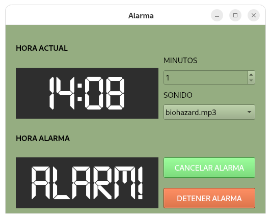

# ¡Alarm! ¡Alarm!

Alarma personal que uso para estudiar



### Modo de uso

Descargar el archivo:
```sh
curl -L -o alarm-alarm-v1.2.tar.xz https://github.com/perseoq/alarm/releases/download/study.alarm/alarm-alarm.tar.xz
```

Instalar el paquete:
```
sudo mkdir -p /opt/alarm-alarm
sudo tar -xJf alarm-alarm-v1.2.tar.xz -C /opt/alarm-alarm --strip-components=1
sudo chmod +x /opt/alarm-alarm/alarm
sudo cp /opt/alarm-alarm/alarm-alarm.desktop /usr/share/applications/
```
Instalador:
- [Descargar instalador](https://raw.githubusercontent.com/perseoq/alarm/refs/heads/main/v1.0/alarm-alarm-installer.sh?token=GHSAT0AAAAAADFJSH4YW4RKRC3EPYXV4IPO2CMRCMQ)

Ejecutar
```sh
chmod +x alarm-alarm-installer.sh
./alarm-alarm-installer.sh
``` 


